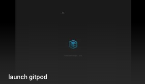

# helloworld
Hello World in Python (see the 'helloworld.py' file)

# execute this code on gitpod (you'll need to login)

* once launched click on the terminal at the bottom right of the screen and type "python helloworld.py"

# execute this code on repl.it
* https://repl.it/@smtest/helloworld

# test video
![demo] (https://github.com/sho-portfolio/helloworld/blob/master/launch-gitpod.mov)
(<iframe width="560" height="315" src="https://www.youtube.com/embed/xEd6JFqaLDw" frameborder="0" allow="accelerometer; autoplay; encrypted-media; gyroscope; picture-in-picture" allowfullscreen></iframe>)

# useful resources and a thank you to the authors
* https://medium.com/gitpod/gitpod-gitpod-online-ide-for-github-6296b907a886
* https://www.gitpod.io/blog/gitpodify/
* https://dev.to/kelli/demo-your-app-in-your-github-readme-with-an-animated-gif-2o3c

